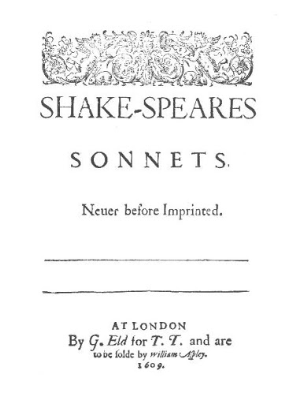

## 
Project Name 

______

##  
 Shakespeare Sonnet Generation 

### Auto Text Generation With LSTM

## Project Description
  
* Auto Text generation using text preprocesing and NLP libraries of keras and tensorflow and testing accuracy and, Predicting Some new text or lines of the poem.

* I have used Bidirectional Multilayer LSTM to train the model and ,Model is fit to a training accuracy of 83%.

### Methods Used
* Deep Learning
* Machine Learning
* Text Generation

### Technologies 
* Python
* Keras
* Tensorflow
 
